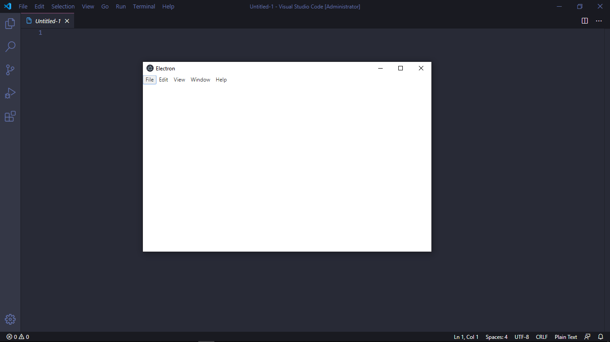

##  Sobre
Navegador flutuante.

---

## Descrição
Este projeto é criação de um navegador flutuante que fica fixo na tela mesmo que o usuário navegue entre outras telas. Pode ser utilizado para acompanhar um projeto em tempo realde forma visual, como tb pode ser utilizado para abrir qualquer página web.

---

## Tecnologias
- HTML
- ELECTRON (https://www.electronjs.org)

---

Desenvolvido por elvesbd.